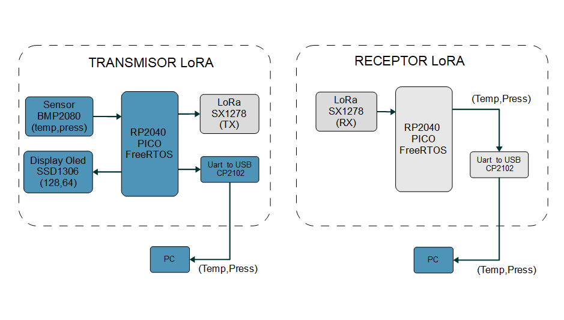

## Trabajo Practico de RTOS con FreeRTOS

## Descripcion del proyecto:

### Introducción

En la era de la Internet de las Cosas (IoT), la necesidad de soluciones de comunicación eficientes y de bajo consumo es primordial. El protocolo LoRa (Long Range) se ha destacado por su capacidad para transmitir datos a largas distancias con un consumo energético mínimo, convirtiéndolo en una opción ideal para diversas aplicaciones IoT. Este proyecto se centra en la integración de la tecnología LoRa con el microcontrolador RP2040, desarrollado por Raspberry Pi, para crear una solución IoT robusta y eficiente.

El RP2040 es un microcontrolador de doble núcleo ARM Cortex-M0+ que ofrece una combinación de alta potencia de procesamiento y flexibilidad, siendo adecuado para una amplia gama de aplicaciones. Al combinar el RP2040 con la tecnología LoRa, podemos desarrollar dispositivos IoT capaces de comunicarse de manera eficiente en entornos donde la cobertura de red tradicional es limitada o inexistente.

La combinación de LoRa y RP2040 ofrece una plataforma poderosa y flexible para el desarrollo de soluciones IoT. La capacidad de LoRa para cubrir grandes distancias y su bajo consumo energético la hacen ideal para aplicaciones donde otros métodos de comunicación inalámbrica no son viables. El RP2040, con su alto rendimiento y versatilidad, proporciona la base perfecta para desarrollar y gestionar las funcionalidades del nodo IoT, permitiendo la creación de soluciones innovadoras y sostenibles.

### Objetivo 

- Desarrollar un dispositivo IoT basado en el microcontrolador RP2040 y el protocolo LoRa. Aprovechando las capacidades del RP2040 y la tecnología LoRa para crear un nodo IoT capaz de recolectar y transmitir datos de manera eficiente, bajo consumo y largas distancias.
-  Implementar una comunicación nodo a nodo: Configurar dos nodos LoRa que permita transmitir datos de sensores de un nodo a otro.
-  Desarrollar un firmware para el microcontrolador rp2040 mediante el uso de RTOS.
-  Aplicación práctica: Implementar una aplicacion que permita visualizar los datos generados por el nodo transmisor de datos.

### Alcance 

El proyecto abarcará desde la selección y configuración del hardware necesario (RP2040, módulos LoRa, sensores a elección) hasta el desarrollo del software con FreeRTOS y la implementación de una comunicación LoRa entre dos dispositivos. Se considerarán a futuro aspectos críticos como la gestión energética, la confiabilidad de la transmisión de datos y la integración con plataformas de análisis y visualización de datos.
Se presentará una versión inicial de un producto (MVP) que incluye las características esenciales necesarias para que funcione y sea presentado a los primeros usuarios.

### Recursos 

- Raspberry RP2040 Pico 
- Sesnor BPM280 (Temperatura y presion ambiental)
- Transceptor LoRa (433MHz) Sx1278
- Display Oled SSD1306 i2c
  
## Diagrama general

- los bloques en gris aún no han sido implementado.

## Hitos y Avances

- Conectar el sensor BPM280
- Conectar, escribir y borrar texto/imag en el display Oled SSD1306
- Enviar los datos del sensor via BMP280 via UART a USB 

https://github.com/sequeirandres/embeddedAndRTTP/assets/72326236/f6114e1f-b008-4984-9d0c-b6c83c61aa74

